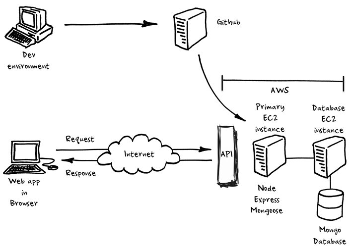

# 2-Tier App Deployment on AWS
We will be creating a 2-tier architecture by launching and setting up 2 EC2 instances on AWS. one instace will be for our nodeapp and the other will be for our database. 



```
**Note:** If you are unsure how to launch a ec2 instance please follow this [link]. 
```

# EC2 instance for DB

### Connect db 
To connect the database to our nodeapp using MongoDB, you should run the following commands:
```
wget -qO - https://www.mongodb.org/static/pgp/server-3.2.asc | sudo apt-key add -

 echo "deb http://repo.mongodb.org/apt/ubuntu xenial/mongodb-org/3.2 multiverse" | sudo tee /etc/apt/sources.list.d/mongodb-org-3.2.list

 sudo apt-get update

 sudo apt-get install -y mongodb-org=3.2.20 mongodb-org-server=3.2.20 mongodb-org-shell=3.2.20 mongodb-org-mongos=3.2.20 mongodb-org-tools=3.2.20

sudo mkdir -p /data/db

 sudo chown -R mongodb:mongodb /var/lib/mongodb

 sudo sed -i 's/127.0.0.1/0.0.0.0/g' /etc/mongod.conf

 sudo systemctl enable mongod

 sudo service mongod start


```

**Note: Remember add a custom port 27017**

# EC2 instance for our nodeapp

### Add the app to the server 

To copy our app folder from the loaclhost to AWS, use the following command in the appropiate directory 
```
# scp -i [path to key] -r [path to file folder on localhost] [path to location on AWS]
scp -i ~/.ssh/eng89_devops.pem -r app/ ubuntu@63.32.46.106:~/app/
```

### Install the required dependencies for the nodeapp

```
!/bin/bash

# Update the sources list
sudo apt-get update -y

# upgrade any packages available
sudo apt-get upgrade -y

# install nginx
sudo apt-get install nginx -y

# install git
sudo apt-get install git -y

# install nodejs
sudo apt-get install python-software-properties
curl -sL https://deb.nodesource.com/setup_12.x | sudo -E bash -
sudo apt-get install nodejs -y

# install pm2
sudo npm install pm2 -g

```

### Create Reverse Proxy 

In order to load the app  without port 3000, we must create the reverse proxy using nginx.

- Enter the nginx default file:

`sudo nano /etc/nginx/sites-available/default`

- Redirect the traffic from 3000 to default port 80:

```
server {
    listen 80;

    server_name _;

    location / {
        proxy_pass http://63.32.46.106:3000;
        proxy_http_version 1.1;
        proxy_set_header Upgrade $http_upgrade;
        proxy_set_header Connection 'upgrade';
        proxy_set_header Host $host;
        proxy_cache_bypass $http_upgrade;
    }
}
```

### Create an env varibale 
Now we must crerate an enironment varaiable toconnect to the DB using:

```
 sudo echo "export DB_HOST=mongodb://54.171.49.157:27017/posts" >> ~/.bashrc
 source ~/.bashrc
 ```

